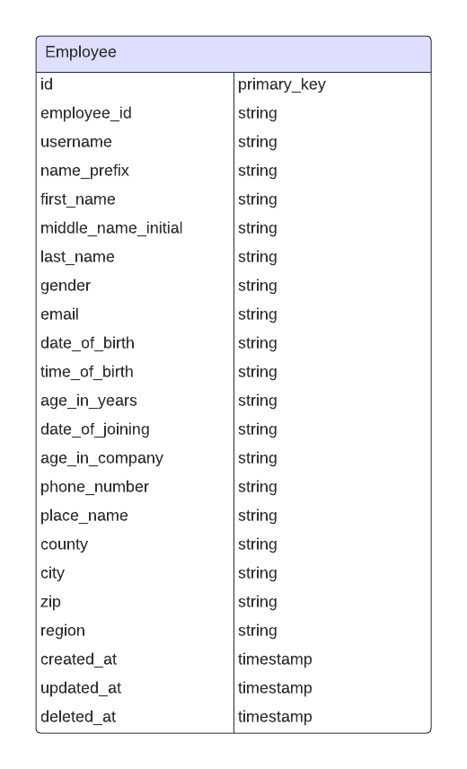

# Employee Batch Import API

Guide to (usage and description of) the Employee Batch Import API.

**Table of Contents**

1. [Technologies Utilized in Crafting Employee Batch Import API](#technologies-utilized-in-crafting-employee-batch-import-api)
2. [API Documentation](#api-documentation)
3. [Database Structure](#database-structure)
4. [How to Install and Run the Employee Batch Import API Application Locally On Your Device](#how-to-install-and-run-the-employee-batch-import-api-locally-on-your-device)
    1. [Requirements](#requirements)
    2. [Installation Procedure](#installation-procedure)
5. [Footnotes !important](#footnotes-important)

## Technologies Utilized in Crafting Employee Batch Import API

Employee Batch Import API is crafted in the following technologies:

1. **Laravel (PHP)** on the server-side.
 <!-- 1. **Laravel Tests** (for writing comprehensive tests for the application) -->
2. **MYSQL** (for database).

## API Documentation

Here is a link to the API documentation:

https://documenter.getpostman.com/view/13239911/2sA3BuVobg

## Database Structure



## How to Install and Run the Employee Batch Import API Application Locally On Your Device

### Requirements:

1. You must have PHP installed on your device. Visit the [official PHP website](https://www.php.net/) and follow the steps for download and installation.

2. After installing PHP, download and install a text editor (e.g. [VS Code](https://code.visualstudio.com/Download)) if you do not have one.

### Installation procedure:

Then go to your terminal and follow these steps:

1. From your terminal, cd (change directory) into your favorite directory (folder) where you would like to have the application files

```
cd C:\Users\maxim\Desktop>
```

Here I changed directory into my personal Desktop space/folder on my Windows Computer. And then;

2. Clone this repository from here on Github using either of the 2 commands on your terminal:

```
git clone https://github.com/maxralph1/employee-batch-import-management-api.git
```

or

```
git clone git@github.com:maxralph1/employee-batch-import-management-api.git
```

3. Change directory into the newly installed "employee-batch-import-management-api" application file with the following commands.

```
cd employee-batch-import-management-api
```

4. From here, use the command below to install all dependencies I utilized in this application as can be seen from my 'composer.json' file

```
composer install
```

5. Spin up the server with the command:

```
php artisan serve
```

Your server traditionally starts on port 8000 (http://localhost:8000), if you have nothing currently running this port.

4. Go to the '.env' file which you must have gotten from modifying the 'env.example' file and make sure the database name is what you want it to be.

5. You should already have a MySQL database installed and running. Create a database instance with same name as that for the database above. I use XAMPP (you can [get XAMPP here] (https://www.apachefriends.org/download.html)). It makes it easier for me.

## Footnotes !important

This application is strictly for demonstration purposes. It is not yet production-ready and should never be used as such.

In order to be able to execute the massive number of inputs, I had to increase the value of the default 60 seconds "max_input_time" on my php.ini file so that it can accomodate the request time for the input/execution time of all 10000 lines of employee records.

On the same php.ini file, I also increased the "max_execution_time = 30" even though this line has no effect on the input/processing time of the CSV file contents of this particular project/task.
